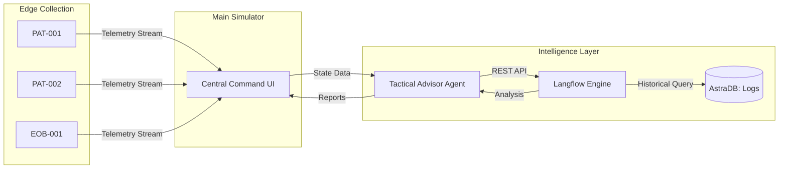

# AECC Tactical Simulator 🛡️

A high-performance tactical dashboard for real-time edge node telemetry and AI-driven situational intelligence.

## 🏗️ System Architecture

The following diagram illustrates the flow of tactical data from edge collection to intelligence synthesis.



## 🔄 Network Flow

Detailed interaction between the simulator's core subsystems:

```mermaid
sequenceDiagram
    participant Edge as Edge Nodes
    participant Central as Central Simulator (React)
    participant Agent as Tactical Advisor (ChatBot.jsx)
    participant Intel as Intelligence Engine (Langflow)
    participant DB as AstraDB

    Edge->>Central: Real-time Telemetry (UDP/Socket)
    Central->>Central: Update Global Tactical Map
    
    rect rgb(15, 23, 42)
        Note over Agent, Intel: Intelligence Query Path
        Agent->>Intel: POST /api/v1/run (Payload + API Key)
        Intel->>DB: Query Historical Context
        DB-->>Intel: Return Tactical Logs
        Intel->>Intel: Analyze Anomalies & Risks
        Intel-->>Agent: JSON Response (Tactical Intel)
    end

    Agent->>Central: Render Formatted Report (Markdown)
```



## 🚀 Key Components

### 1. Central Simulator (`App.jsx`)
The hub of the operation. It aggregates real-time metrics, manages node states, and renders the situational map. It provides the "Ground Truth" for all tactical decisions.

### 2. Tactical Advisor (`ChatBot.jsx`)
A custom-built, premium React component using a 'frosted glass' tactical UI. Features:
- **Persistent Sessions**: Uses `crypto.randomUUID()` for backend context.
- **Rich Formatting**: Custom Markdown renderer for bullet points and bold tactical data.
- **Dynamic Layout**: Toggle between a compact popup and a full-screen HUD view.

### 3. Intelligence Engine (Langflow)
The "Intelligence Layer" of the system. It processes complex queries by cross-referencing live telemetry with historical event logs in AstraDB.

### 4. AstraDB Persistence
Stores all tactical events and anomaly logs. It enables the AI to "remember" previous failures and trends, providing the critical historical context required for accurate risk detection.

## ⚙️ Getting Started

1.  **Start the Simulator**:
    ```bash
    npm install
    npm run dev
    ```
2.  **Start Langflow**:
    Ensure your Langflow server is running at `http://localhost:7860` with the provided flow ID: `604fddf2-a7af-44f9-a8ef-ee5052ff89b7`.
3.  **API Configuration**:
    The system uses the `sk-t0jR...` tactical key for secure server-to-server communication.
